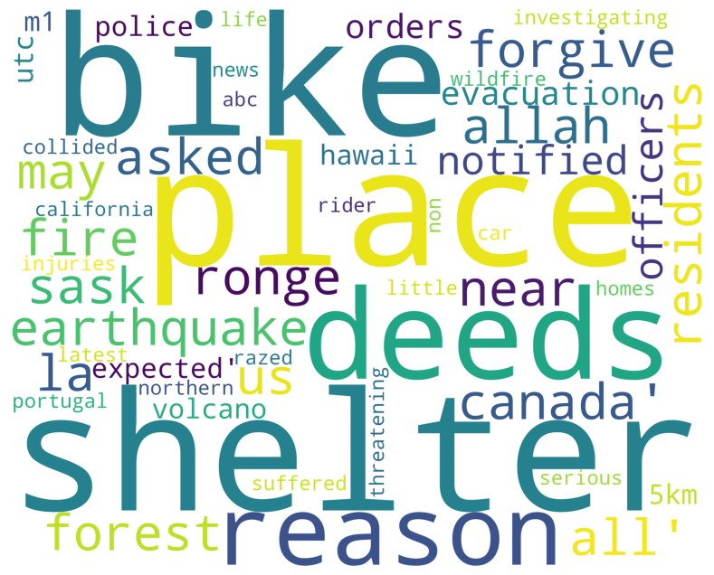
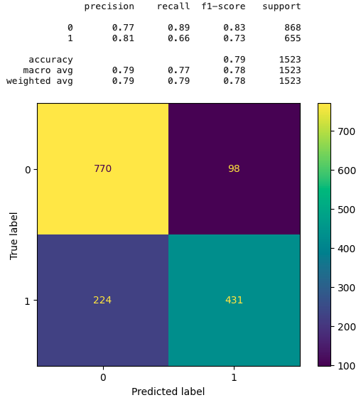

# Natural Language Processing with Disaster Tweets
**Competition on [kaggle.com](https://www.kaggle.com/competitions/nlp-getting-started/overview) for classifying tweets for their postive or negative sentiment around disasters.**

### 1) Data Exploration and Analysis 

Script uses regex filtering on the tweets to clean up certain patterns and word types (links, emojis, single character typos, etc.)
This results in a relativly clean data set. See word cloud **(right)** for most common words in the data set.

### 2) Data Processing and Preparation
Training and test data are treated the same way with the test set never 'seeing' the training set for spillover. The training set is further split into a train and test for testing and validation of protocol and ML models.

The Data is vectorized using TfidfVectorizer in the sklearn package.

### 3) Model Selection and Testing
Four different models are tested using the split data and grid searching of parameters to compare and contrast the training speed and accuracy in order to find the model with the best final performance. (f1-score used in final selections).

Example comparison **(right)** information with the classification report and confusion matrix of spllit test data.

**Models:**
MultinomialNB (Naive Bayes)
* Time to fit = 0.123s
* f1-score = 0.7280

Logistic Regression
* Time to fit = 11.186s (large grid search)
* f1-score = 0.7405 **BEST**

SGDClassifier (Stochastic Gradient Descent)
* Time to fit = 0.031s
* f1-score = 0.7410

LinearSVC (Support Vector Machine)
* Time to fit = 1.375s
* f1-score = 0.7309

### 4) Use Logistic Regression Model for final data set
Train final model with entire training set with best parameters found in testing phase.

**Final submission score = 0.7916**

This is not a great result and can probably be improved with further processing of the data sets for filtering odd words and keywords for finding the sentiment.
